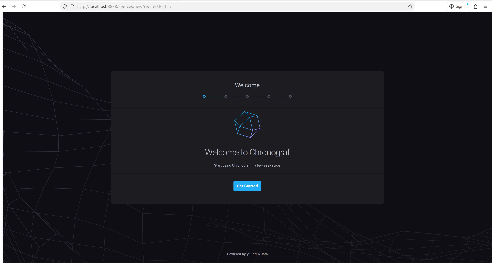
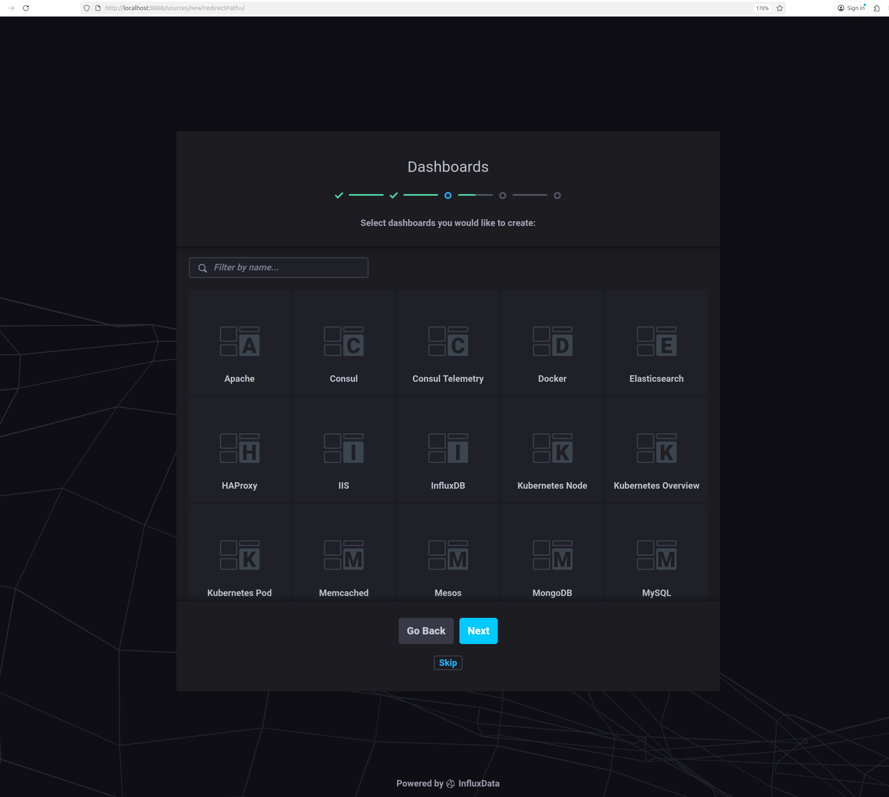
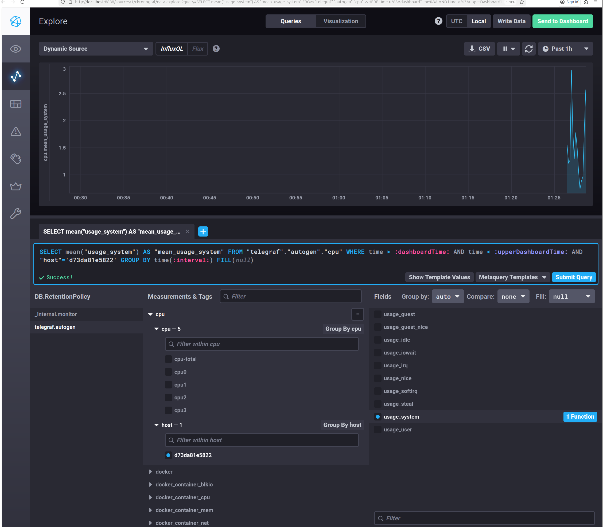
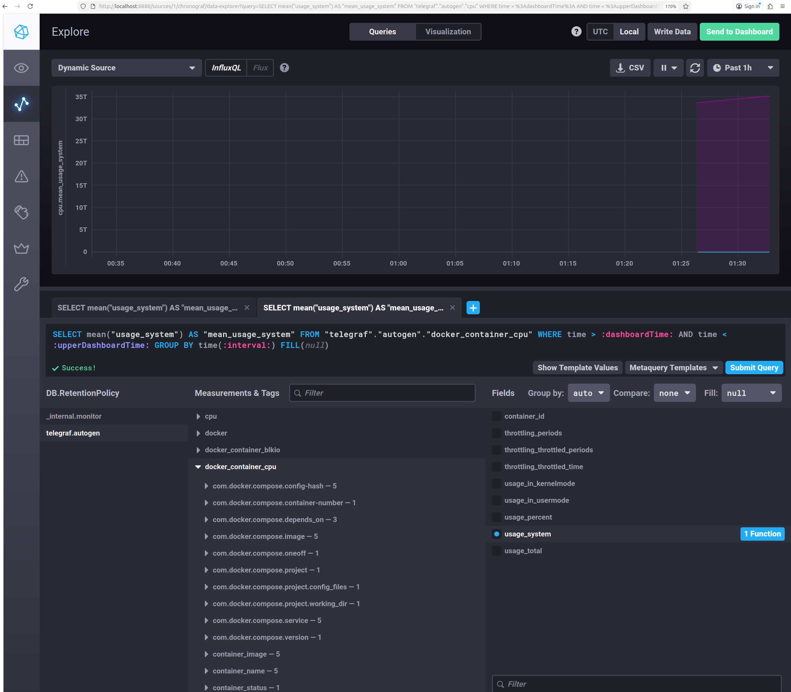
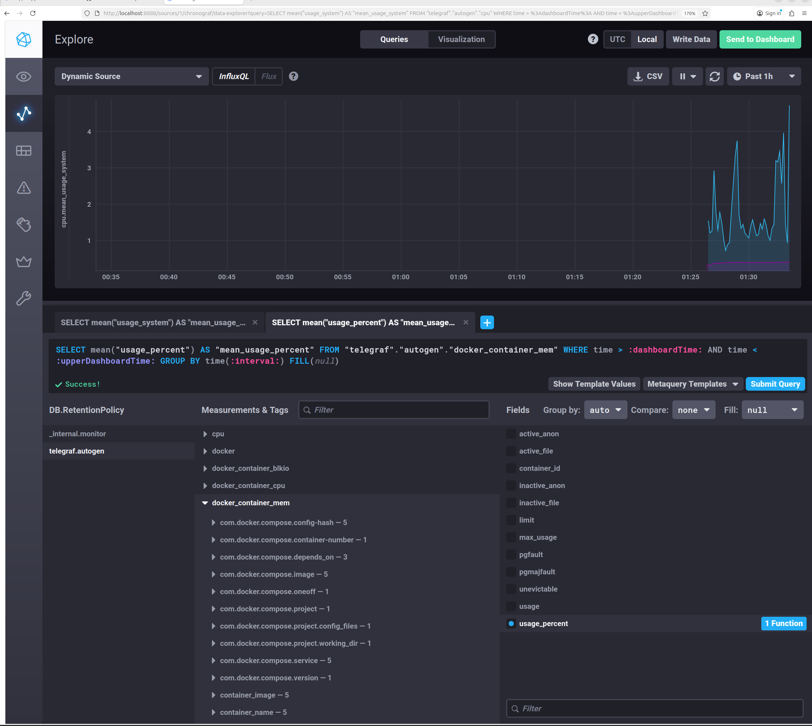
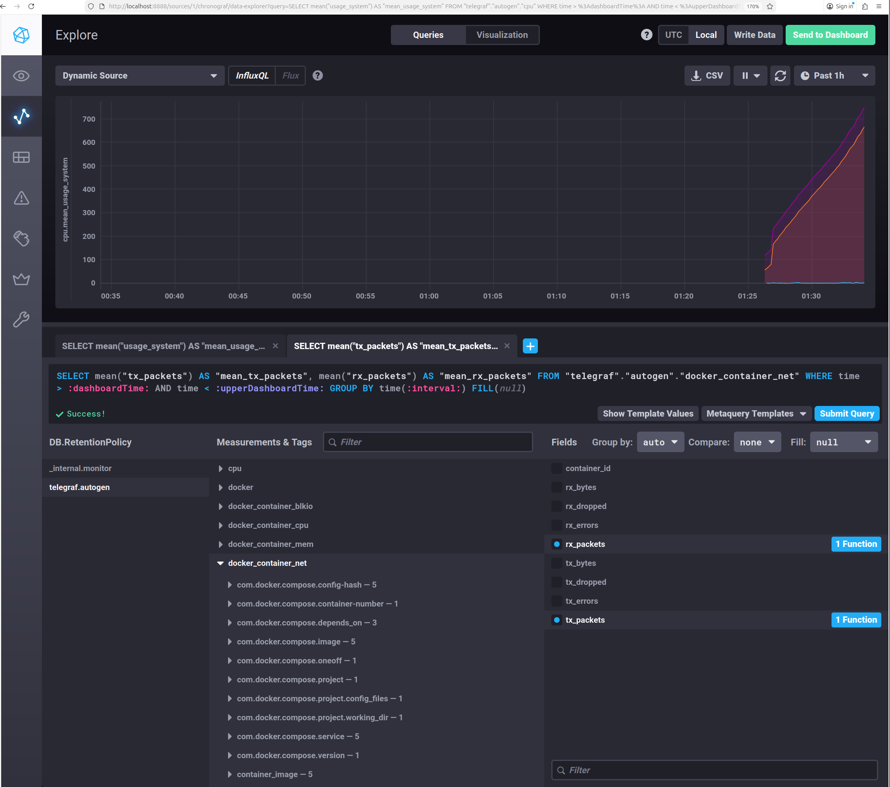

# Домашнее задание к занятию "13.Системы мониторинга"

## ТЕОРИЯ

## 1. Минимальный набор метрик для мониторинга проекта

### Исходные условия
- HTTP-сервис
- Выполняет вычисления → нагружает CPU
- Генерирует текстовые отчёты и сохраняет их на диск

---

### Минимальный набор метрик

#### Доступность сервиса
- HTTP availability (up/down)
- Проверка `/health` или основного endpoint

**Почему:** если сервис недоступен — остальные метрики не имеют значения.

---

#### HTTP-метрики
- Количество запросов (RPS)
- HTTP-коды ответов (2xx / 4xx / 5xx)
- Время ответа (latency):
  - среднее
  - p95 / p99

**Почему:** взаимодействие с платформой идёт по HTTP, значит качество сервиса измеряется скоростью и корректностью ответов.

---

#### CPU
- CPU usage (%)
- Load Average (1 / 5 / 15)

**Почему:** вычисления нагружают процессор — это ключевой ресурс.

---

#### Память
- Использование RAM
- Swap usage

**Почему:** нехватка памяти может привести к деградации или падению сервиса.

---

#### Диск
- Свободное место на диске
- Использование inodes

**Почему:** отчёты сохраняются на диск → диск или inode’ы могут закончиться.

---

### Итоговый минимальный набор
- HTTP availability
- HTTP status codes
- HTTP latency
- CPU usage / load average
- RAM usage
- Disk space / inodes

---

## 2. Менеджеру непонятны RAM / inodes / CPUla. Что предложить?

Менеджеру важны SLA и качество сервиса, а не технические показатели.

### Что можно предложить

#### SLA / SLO / SLI (бизнес-метрики)
- Доступность сервиса (% uptime)
- Процент успешных запросов
- Время ответа сервиса
- Количество ошибок за период

**Примеры:**
- «Сервис доступен 99.9% времени»
- «95% запросов обрабатываются быстрее 500 мс»
- «Ошибки составляют менее 0.1% запросов»

---

#### Перевод технических метрик в понятные показатели

| Техническая метрика | Бизнес-смысл |
|-------------------|-------------|
| CPU load | Сервис не справляется с нагрузкой |
| RAM | Риск деградации или падения |
| Disk / inodes | Риск остановки генерации отчётов |
| HTTP latency | Клиенты долго ждут |

Менеджеру показываем результат, инженерам — причины.

---

## 3. Нет системы сбора логов, но разработчикам нужны ошибки

### Возможные решения без бюджета

#### stderr + docker/systemd logs
- Приложение пишет ошибки в stderr
- Просмотр логов:

```
docker logs <container>
journalctl -u service -p err
```

---

#### Метрики ошибок
- Счётчики:
  - `application_errors_total`
  - `http_requests_5xx_total`
- Настройка алертов при росте ошибок

Разработчики видят факт и количество ошибок.

---

#### Локальные файлы + logrotate
- Ошибки пишутся в файл
- Настроена ротация логов
- Доступ по SSH

---

#### Уведомления
- Ошибки отправляются через webhook в Telegram или email

---

## 4. SLA = 99%, но получается 70%, при этом нет 4xx и 5xx

### Формула
```
SLA = sum_2xx_requests / sum_all_requests
```

### Где ошибка
В `sum_all_requests` попадают не только ответы 2xx / 4xx / 5xx.

**Возможные причины:**
- HTTP 3xx (redirect)
- Таймауты
- Прерванные соединения
- Health-check запросы
- Несовпадение источников метрик

Эти запросы не являются 2xx, но и не 4xx или 5xx.

---

### Как правильно
- Явно определить, какие коды считаются успешными
- Часто используются 2xx + допустимые 3xx
- Исключить служебные запросы (health-check)

---

## 5. Плюсы и минусы pull и push систем мониторинга

### Pull-модель

**Принцип:** система мониторинга сама забирает метрики

**Плюсы:**
- Простая архитектура
- Контроль со стороны мониторинга
- Нет необходимости открывать входящие порты

**Минусы:**
- Проблемы с NAT и firewall
- Сложно мониторить динамические или временные узлы

---

### Push-модель

**Принцип:** агенты сами отправляют метрики

**Плюсы:**
- Удобно для динамических сред
- Работает за NAT

**Минусы:**
- Сложнее контроль доставки
- Возможна потеря метрик
- Требует дополнительной инфраструктуры

---

## 6. Push / Pull / Hybrid системы

| Система | Модель |
|--------|--------|
| Prometheus | Pull |
| TICK | Push |
| Zabbix | Hybrid |
| VictoriaMetrics | Hybrid |
| Nagios | Pull |

---

## ПРАКТИКА






